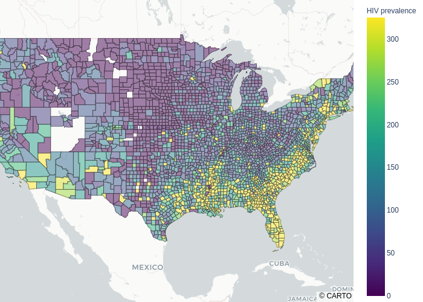

# covid-hiv-geo-analysis

</img>

## Overview
This repo is an ongoing project to explore the commonalities between two major epidemics affecting the United States--the HIV epidemic and the COVID epidemic. While the two diseases are very different in terms of transmission modalities, their geographic distributions appear to overlap. Can useful information be obtained by understanding if, and why, these geographic distributions overlap? 

This is an ongoing project. New information will be added soon. While this information is public, please be respectful of the origination of these ideas within this repo and their status as a work in process.

## Goals

The goals of this project are
> - To quantify the overlap of the geographic distributions of the HIV epidemic and the COVID epidemic
> - To explore differences in the delivery of public health where the epidemics are most severe versus other parts of the country
> - To evaluate if and how public officials communicate differenlty about epidemics in different parts of the country

## Tools and techniques used in this project
- **Tools**
> - Python, Jupyter Lab, SciKitLearn, Pandas, Numpy
- **Visualization**
> - Plotly, Matplotlib
- **Techniques**
> - Supervised learning model development, spatial mapping

## Data and EDA
Data on HIV and COVID infection rates were obtained from the following sources:
- https://github.com/nytimes/covid-19-data (COVID incidence by county data) 
- https://gis.cdc.gov/grasp/nchhstpatlas/main.html (HIV incidence/prevalence) 
- EDA of the HIV incidence rates (number of new infections in a given year) revealed a lot of missing data at the county level, and low numbers for many other counties. A decision was made to use prevalence as the comparative marker of the disease. Prevalence--while not perfect--is the most accurate measure of the penetration of the disease. The downsides are that it doesn't necessarily indicate where the disease was contracted since people are mobile. 
- For COVID, incidence is the only measure that makes sense since it is not a persistent illness. 
- Fortunately, HIV is much less common than COVID, so incidence numbers are smaller--even nonexistent (or at least not reported) in many counties. 
- Spatial maps and a scatter matrix were created to compare COVID incidence rates by county to HIV prevalence by county. The spatial maps appear to show commonality of the infection distributions, but the scatter matrix demonstrates that the regional strength of signal may not translate down to the county level. I.e. while the map suggests a strong geographic trend, the trend may not be as apparent at the county level. Perhaps there's too much point variation.
- It was hypothesized that this problem could be addressed by regionalizing the data by creating KNN Regressor predictions. 
- Maps can be accessed by clicking on the links below.
- [HIV Prevalence Spatial Map]('img/hiv_prev_map.html')
- [COVID Incidence Spatial Map]('img/July_31_covid_map.html')

## Results
- KNN Regressor models were created to create an epidemic predictor from the covid data and separately for the hiv data. A KNN of 10 was used to 'regionalize' the hiv data and the covid data.
- These KNN prediction mappings appear to show a much stronger regional pattern. The R^2 for these maps is .65, suggesting a moderate correlation.
- Prediction maps can be accessed by clicking on the links below.
- [HIV Prediction Map]('img/hiv_epidemic_prediction.html')
- [COVID Prediction Map]('img/covid_epidemic_prediction.html')
- [Scatter Matrix]('img/prediction-scatterplot.png')

## Future Directions
- This project can go in one of several directions.
> - One possibility is to explore the financial impact of the disease on a regional basis. The two diseases evaluated here are widespread and costly. The annual cost to treat someone with HIV is estimated to be as high as $75,000. The economic impact of COVID is quite apparent. The treatment cost for a hospitalized COVID patient is high. And then there's the derivative costs to the economy more broadly. Predictive models could be created to forecast the regional cost of these and future epidemics.
> - What factors might be contributing to the overlapping spatial distributions of these two infectious diseases? It may be coincidence. Or any number of factors might be at play ranging including uncontrollable factors such as weather or socioeconomic variation. One area for research is public health. Three areas that may merit further exploration are: differences in public health resource allocation; differences in how public officials talk about public health; and differences in how the public views public health.

## Contributors
[Rob Salvino](https://github.com/salvir1)

## License
[MIT ©](https://choosealicense.com/licenses/mit/)
