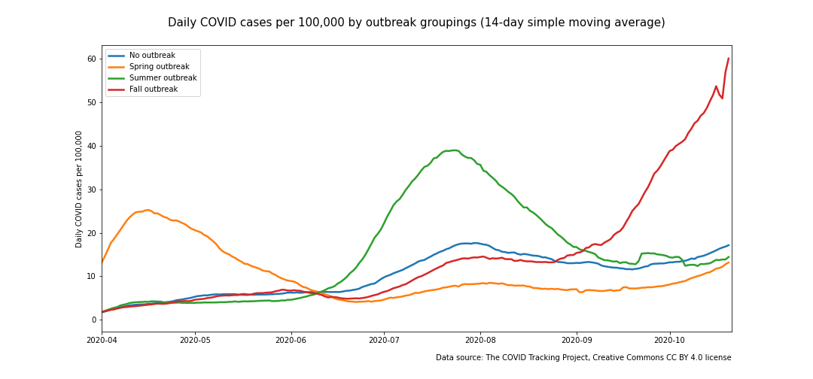
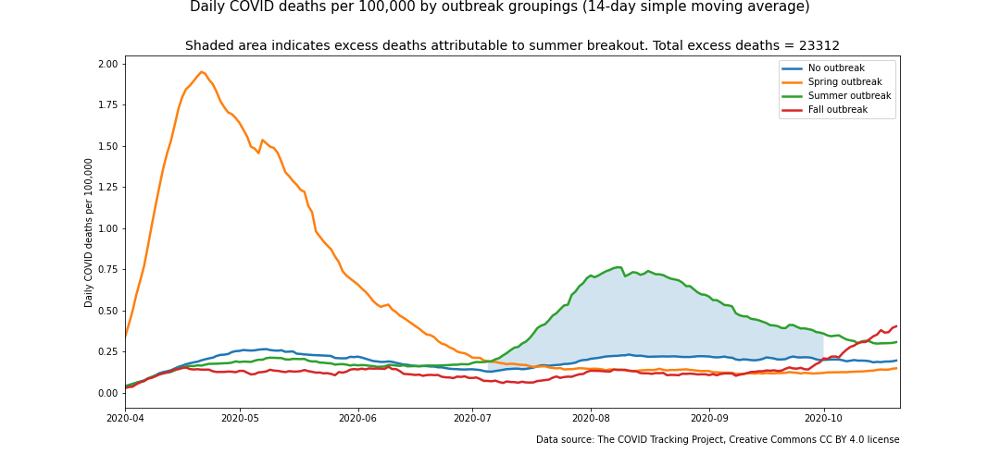

# covid-19-geographic-analysis

</img>

## Overview
This repo is an ongoing project to explore the geographic patterns in the COVID-19 pandemic with particular focus on the US. The goal is to identify meaningful observations that could potentially be used by entities that are seeking to control and/or respond to the crisis.

This is an ongoing project. New information will be added soon. Please recognize that the ideas and reasearch in this repo are a work in process.

## Goals

The goals of this project are
> - To look for meaningful patterns in the geogrpahic progression of the COVID-19 pandemic, especially in the US
> - To work with various EDA and data visualization tools and techniques
> - This project began in mid August. An early goal was to compare the geographic distribution of HIV to the geographic distribution of COVID-19 at that time since the distributions were similar. At this time, COVID-19 had eased up in the northeast and was in the midst of a peak in the southeast, which is one of the primary areas where HIV is most prevalent. These results were kept in the Github repo as a timepoint reference even though the geographic distribution of COVID-19 has since evolved.

## Tools and techniques used in this project
- **Tools**
> - Python, Jupyter Lab, SciKitLearn, Pandas, Numpy
- **Visualization**
> - Plotly, Matplotlib
- **Techniques**
> - Supervised learning model development, spatial mapping, simple moving average

## COVID-19 trend analysis

### Data and EDA
Data for the COVID-19 trend analysis was obtained from the following sources:
- [the COVID Tracking Project](https://www.covidtrackingproject.com), Creative Commons CC BY 4.0 license
- Jones, Sarah P., Imperial College London Big Data Analytical Unit and YouGov Plc. 2020, Imperial College London YouGov Covid Data Hub, v1.0, YouGov Plc, April 2020
For the US data, state groupings were created for outbreaks of similar scale and timeframe. States were grouped into one of four categories:
- Spring outbreak
 -- Occurred primarily in the northeast, Michigan, and Louisiana
 -- Exceeded 40 cases per 100,000 per day or 0.8 deaths per 100,000 per day before May
- Summer outbreak
 -- Occurred primarily in the southeast and Arizona
 -- Exceeded 40 cases per 100,000 per day or 0.5 deaths per 100,000 per day between June and August
- Fall outbreak
 -- Upper midwest and Arkansas at this time with more states to be added if they meet the threshholds
 -- Exceeded 40 cases per 100,000 per day or 0.5 deaths per 100,000 per day after August
- No outbreak
 -- Avoided classification in one of the other outbreak categories
 
### Findings and comments

</img>
</img>
</img>
</img>

## HIV prevalence/COVID-19 incidence comparison

### Data and EDA

For the HIV prevalence/COVID-19 incidence comparison, data on HIV and COVID infection rates were obtained from the following sources:
- https://github.com/nytimes/covid-19-data (COVID incidence by county data) 
- https://gis.cdc.gov/grasp/nchhstpatlas/main.html (HIV incidence/prevalence) 
- EDA of the HIV incidence rates (number of new infections in a given year) revealed a lot of missing data at the county level, and low numbers for many other counties. A decision was made to use prevalence as the comparative marker of the disease. Prevalence--while not perfect--is the most accurate measure of the penetration of the disease. The downsides are that it doesn't necessarily indicate where the disease was contracted since people are mobile. 
- For COVID, incidence is the only measure that makes sense since it is not a persistent illness. 
- Fortunately, HIV is much less common than COVID, so incidence numbers are smaller--even nonexistent (or at least not reported) in many counties. 
- Spatial maps and a scatter matrix were created to compare COVID incidence rates by county to HIV prevalence by county. The spatial maps appear to show commonality of the infection distributions, but the scatter matrix demonstrates that the regional strength of signal may not translate down to the county level. I.e. while the map suggests a strong geographic trend, the trend may not be as apparent at the county level. Perhaps there's too much point variation.
- It was hypothesized that this problem could be addressed by regionalizing the data by creating KNN Regressor predictions. 
<!-- - Maps can be accessed by clicking on the links below. -->
- HIV prevalence by county (active plotly maps aren't available for markdown)
</img>

<pre>

</pre>  
- COVID incidence (as of July 31, 2020) by county
</img>

<!-- - [HIV Prevalence Spatial Map]('img/hiv_prev_map.png')
- [COVID Incidence Spatial Map]('img/July_31_covid_map.png') -->
<pre>

</pre>
### Results
- KNN Regressor models were created to create an epidemic predictor from the covid data and separately for the hiv data. A KNN of 10 was used to 'regionalize' the hiv data and the covid data.
- These KNN prediction mappings appear to show a much stronger regional pattern. The R^2 for these maps is .65, suggesting a moderate correlation (see graph at top of page).
- Regionalized HIV prevalence
</img>
<pre>

</pre>  
- Regionalized COVID incidence
</img>
<pre>

</pre>
<!-- - Prediction maps can be accessed by clicking on the links below. -->
<!-- </img>
</img> -->

<!-- - [HIV Prediction Map]('img/hiv_epidemic_prediction.html')
- [COVID Prediction Map]('img/covid_epidemic_prediction.html')
- [Scatter Matrix]('img/prediction-scatterplot.png') -->

## Contributors
[Rob Salvino](https://github.com/salvir1)

## License
[MIT ©](https://choosealicense.com/licenses/mit/)
